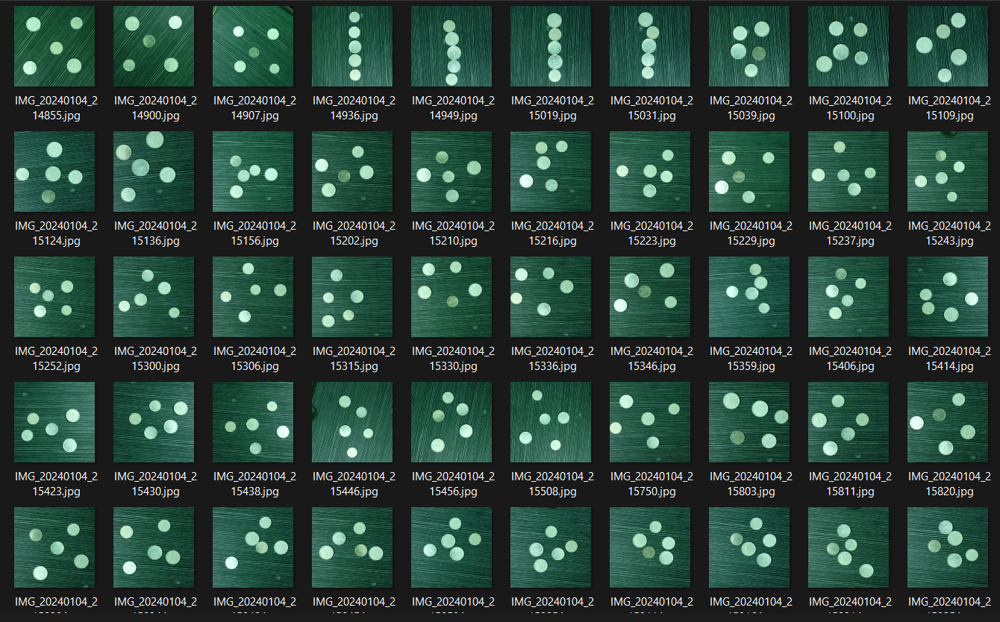
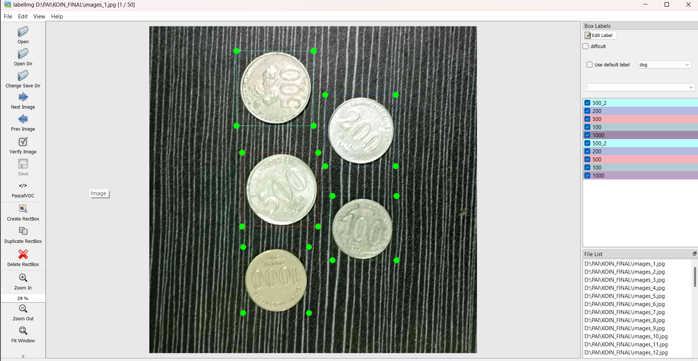
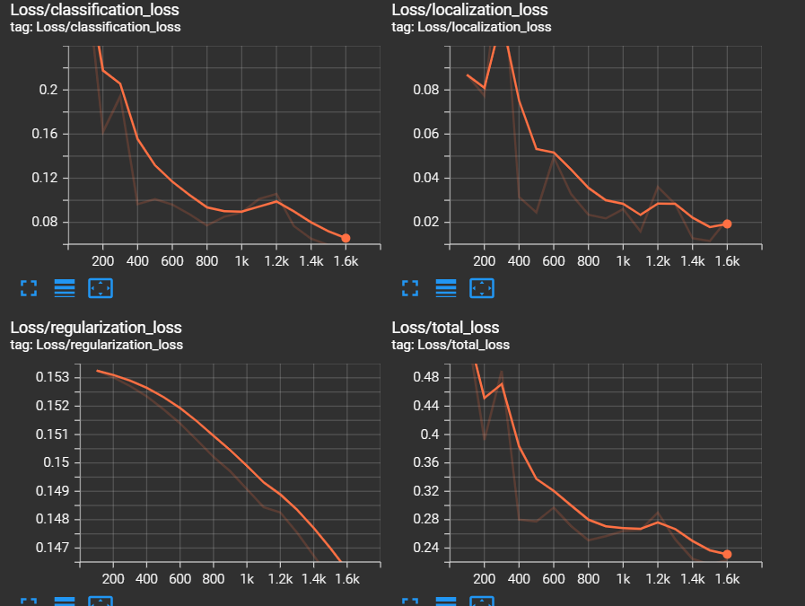
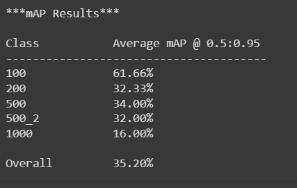
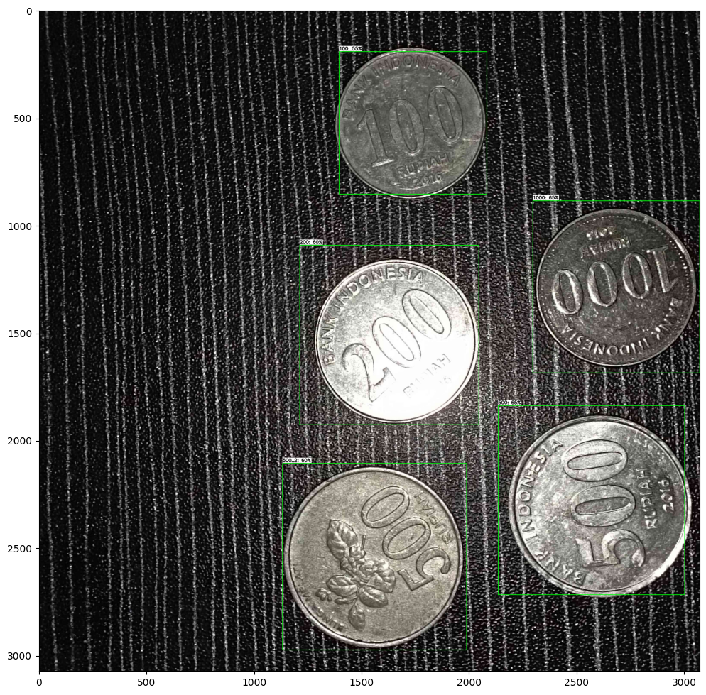
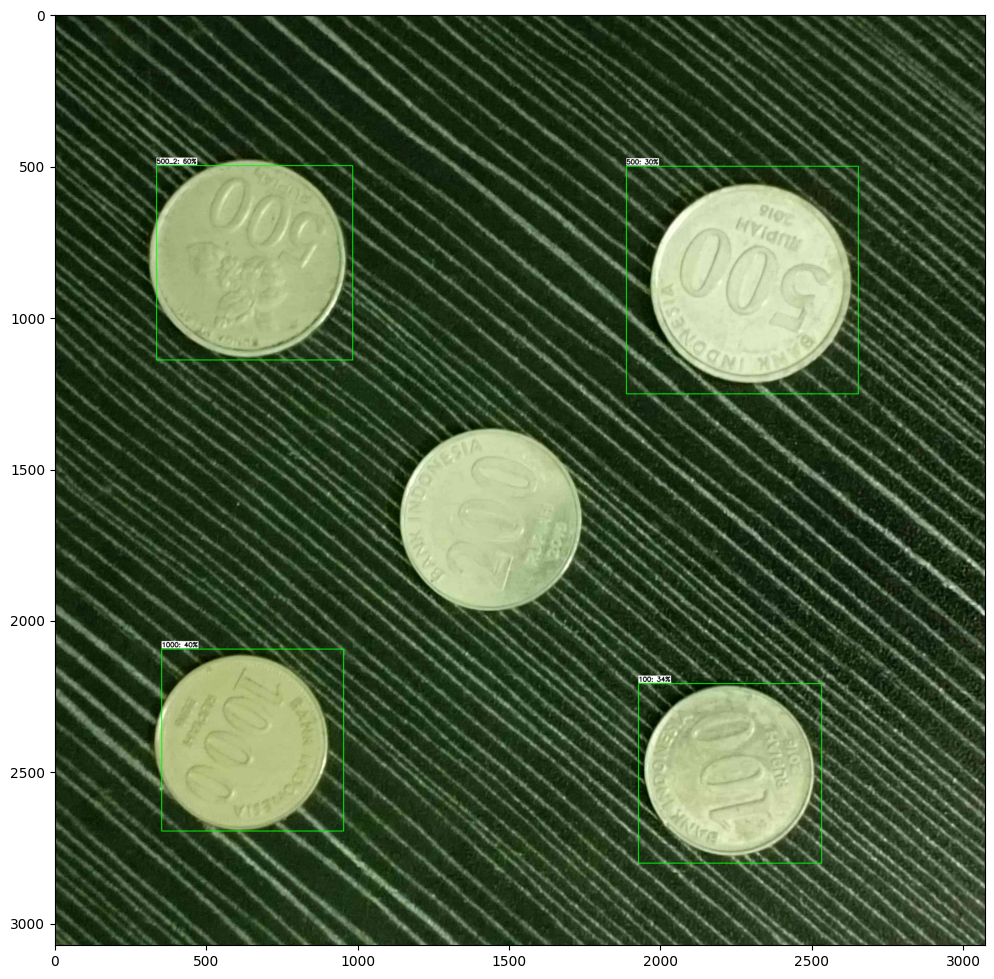
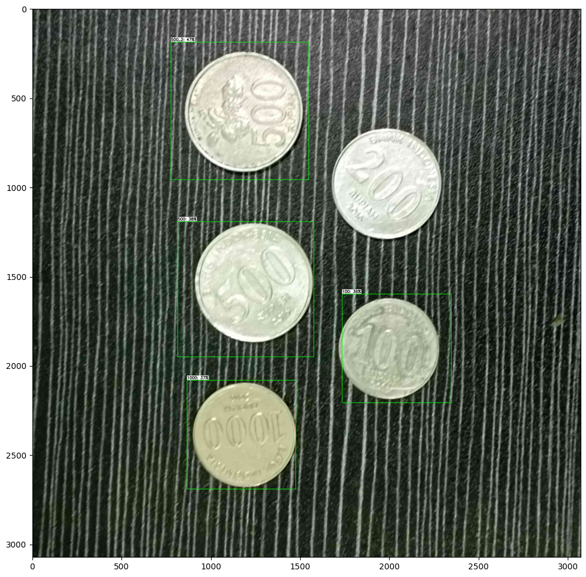

# Penghitung Koin

## Aplikasi python penghitung koin menggunakan kecerdasan buatan dengan mendeteksi gambar koin dan menghitung jumlah dari nilai koin yang terdeteksi pada layar.

# Cara Instalasi

### 1. Pull atau download source code dari github.
### 2. Install requirement library yang dibutuhkan.
### 3. Buka main.py dan jalankan program.
### 4. Coba aplikasi dengan background berwarna hitam dan penerangan yang cukup.

# Proses Pembuatan
#### 1. Gathering data atau mengumpulkan data satu persatu

#### 2. Labeling Image atau memberikan label pada object yang ingin dideteksi

#### 3. Setting model stuktur yang akan digunakan
#### 4. Proses training data menggunakan data yang telah disiapkan sebelumnya dan struktur model yang telah disetting

#### 5. Konversi hasil training kedalam 1 file tensorflow lite
#### 6. Hitung presisi dari model yang telah didapatkan

#### 7. Tambatkan model pada suatu aplikasi agar dapat menerima input dan menampilkan output

